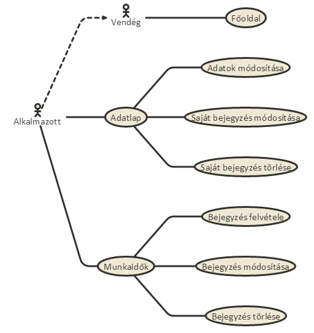
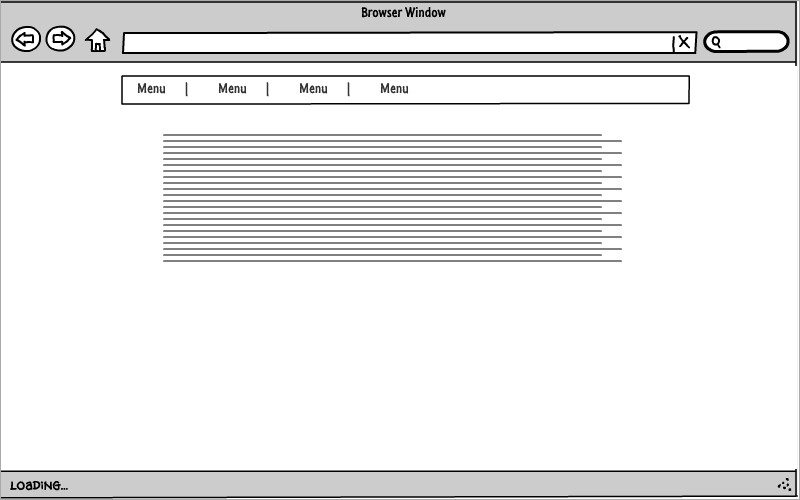
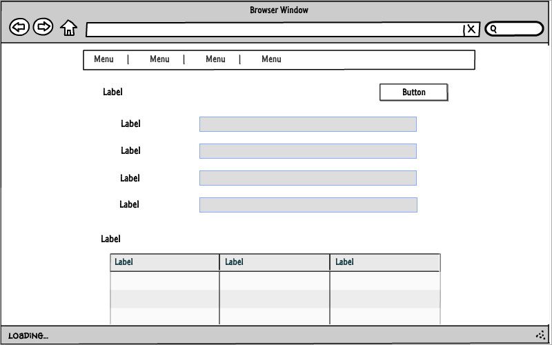
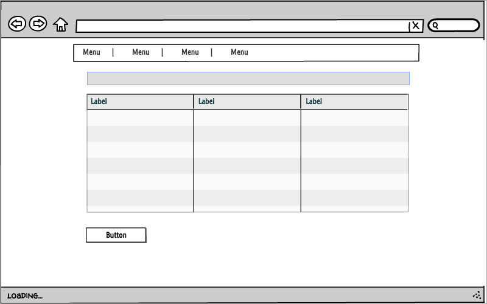
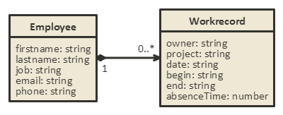

# Online jelenléti ív alkalmazás

## I. Követelményanalízis

Az alkalmazás célja a a dolgozok munkaidejének online adminisztrálása gyorsan és egyszerűen. 
Internet hozzáférés mellett platformfüggetlenül.
...

...

#### Funkcionális elvárások
* **Vendégként**,
    * Szeretnék regisztrálni, hogy ügyfél lehessek. --> Regisztráció
    * Szeretnék bejelentkezni az alkalmazásba. --> Bejelentkezés
* **Alkalmazott**,
    * Szeretnék új bejegyzéseket felvenni
    * Szeretnék meglévő bejegyzéseket szerkeszteni
    * Szeretnék bejegyzéseket törölni
    * Szeretném az adataimat módosítani
    * Szeretném látni a bejegyzéseimet
    * Szeretném látni az összes bejegyzést
    * Szeretném a szünetemet módosítani

* A funkciók csak bejelentkezett ügyfelek számára elérhetőek, kivéve a regisztráció. 
A belépéshez szükséges adatok adatbázisban tárolódnak, ezek segítségével történik az autentikáció.
A főoldalon esetleg információk jelenhetnek meg az alkalmazással kapcsolatban.

#### Nem funkcionális követelmények
* Egyoldalas alkalmazás.
* Felhasználóbarát, modern, letisztult elrendezés és felépítés.
* Gyors működés, a funkciók magas rendelkezésre állása.
* Az adatokhoz gyorsan és könnyedén férhetünk hozzá a megvalósított funkciók álltal.

### Használatieset-model, funkcionális követelmények

#### Szerepkörök
* **Vendég**: Hozzáférhet a főoldal tartalmához, továbbá a regisztrációs ürlaphoz és a bejelentkezés funkcióhoz
* **Alkalmazott**: Teljes körű hozzáférést biztosít a program számára, módosíthatja adatait, új munkaidő bejegyzést vehet fel, módosíthat és törölhet

#### Használati-eset diagram.

#### Folyamatok.

**1. Regisztráció**

A regisztráció vendégek számára elérhető. A linkre kattintva meg kell adnia a felhasználónak pár rá vonatkozó adatot (e-mail cím, jelszó, lakhely, stb.).
Ha a regisztráció sikertelen az alkalmazás egy hibaüzenetben tájékoztatja a felhasználót a keletkezett problémáról.

...

...

## II. Tervezés

#### Oldaltérkép
_Publikus:_

* Főoldal
* Regisztráció
* Bejelentkezés

_Alkalmazott:_

* Főoldal
* Bejelentkezés
* Adatlap
    * Személyes adatok módosítása
    * Saját munkaidők listája
    * Munkaidő törlése
    * Szünet módosítása
* Munkaidők
    * Munkaidők listája
    * Munkaidő törlése
    * Szünet módosítása

#### Végpontok
* GET / : Főoldal
* GET /login : Belépés oldal
* POST /login : Belpési adatok elküldése
* GET /reg : Regisztrációs oldal
* POST /reg : Alkalmazott felvétele
* GET /profile : Adatlap oldal
* UPDATE /profile : Adatlap módosítása, szünet módosítása
* DELETE /profile : Munkaidő törlése
* GET /times : Munkaidők oldal
* POST /times : Új bejegyzés létrehozása
* UPDATE /times : Bejegyzés szerkesztése
* DELETE /times : Bejegyzés törlése

### Felhasználóifelület-modell (Oldalvázlatok)

**_Regisztráció_**

**_Regisztráció_**

**_Bejelentkezés_**

**_Adatlap_**

**_Munkaidők_**

### Osztálymodell

#### Adatmodel

#### Adatbázisterv

#### Állapotdiagram

### Dinamikus működés

Szekvenciadiagram

## III. Implementáció

**Környezet**

Az alkalmazás fejlesztéséhez a [Cloud9](http://c9.io) felhő alapú IDE-ja szolgált.
A virtuális gép paraméterei a következők: CPU - 1 mag, RAM - 1 GB, HDD - 5 GB.
A környezet lehetővé teszi az alkalmazás futtatását és tesztelését a fejlesztés során.

**Fejlesztéshez használt nyelv és csomagok**

Az implementáció során az Ember.js keretrendszert használtuk.
A framework segítségével kliens oldali egyoldalas alkalmazások készíthetőek.
Ezt támogatjuk meg a JQuery nyújtotta lehetőségekkel, a felhasználói felület
kialakításához a Bootstrap és Bootswatch nyújtotta megoldásokat használtunk.

**Fejlesztésre került modulok bemutatása**

* **/app/adapters**
    * /application.js

* **/app/component**
    * /time-form.js
    
* **/app/controllers**
    * /new-workrecord.js
    * /profile.js
    * /workrecord.js
    * /workrecords.js
    
* **/app/models**
    * /employee.js
    * /workrecord.js

* **/app/routes**
    * /index.js
    * /new-time.js
    * /profile.js
    * /workrecord.js
    * /workrecords.js

* **/app/templates**
    * /components/time-form.hbs
    * /application.hbs
    * /index.hbs
    * /new-time.hbs
    * /profile.hbs
    * /workrecord.hbs
    * /workrecords.hbs

## IV. Tesztelés

Tesztesetek:

1. Regisztráció helyes adatokkal

2. Regisztráció helytelen adatokkal

3. Bejelentkezés hejes adatokkal

4. Bejelentkezés hibás adatokkal

5. Adatlap szerkesztése

6. Szünet módosítása

7. Bejegyzés felvétele

8. Bejegyzés módosítása

## V. Felhasználói dokumentáció

**Rendszerkövetelmény**

Processzor: Intel vagy AMD, 1 gigahertzes (GHz) vagy gyorsabb 

RAM: 1 GB (32 bites vagy 64 bites)

Merevlemez-terület: minimum 1 GB

**Alkalmazás telepítése**

* `git clone https://github.com/hordavid/workrecords.git`
* Mappa átnevezése
* `npm install`
* `bower install`
* Futtatás: `ember server`

### A program használata:
Az alkalmazás funkcióihoz bejelentkezés szükséges. Ezt megtehetjük a kezdő képernyőn a `Bejelentkezés` linkre kattintva. 
Itt meg kell adnunk a regisztráció során megadott e-mail címet és a jelszót.

1. Személyes adatok szerkesztése:

    ...
    
    ...

...

...