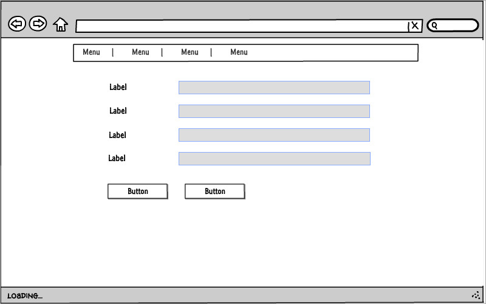

# Online jelenléti ív alkalmazás

## I. Követelményanalízis

Az alkalmazás célja a dolgozok munkaidejének online adminisztrálása gyorsan és egyszerűen. 
Internet hozzáférés mellett platformfüggetlenül.

#### Funkcionális elvárások
* **Vendégként**,
    * Szeretnék bejelentkezni az alkalmazásba.

* **Alkalmazott**,
    * Szeretnék új bejegyzéseket felvenni
    * Szeretnék meglévő bejegyzéseket szerkeszteni
    * Szeretnék bejegyzéseket törölni
    * Szeretném az adataimat módosítani
    * Szeretném látni a bejegyzéseimet
    * Szeretném látni az összes bejegyzést
    * Szeretném a szünetemet módosítani

* A funkciók csak bejelentkezett felhasználók számára elérhetőek.
A főoldalon esetleg információk jelenhetnek meg az alkalmazással kapcsolatban.

#### Nem funkcionális követelmények
* Egyoldalas alkalmazás.
* Felhasználóbarát, modern, letisztult elrendezés és felépítés.
* Gyors működés, a funkciók magas rendelkezésre állása.
* Az adatokhoz gyorsan és könnyedén férhetünk hozzá a megvalósított funkciók álltal.

### Használatieset-model, funkcionális követelmények

#### Szerepkörök
* **Vendég**: Hozzáférhet a főoldal tartalmához
* **Alkalmazott**: Teljes körű hozzáférést biztosít a program számára, módosíthatja adatait, új munkaidő bejegyzést vehet fel, módosíthat és törölhet

#### Használati-eset diagram.

#### Folyamatok.

A program szimulálja a belépett felhasználót, nincs külön login. Egy magadott felhasználót látunk a programban.

**1. Személyes adatok módosítása**

Az adatlap fülön elérhető egy szerkesztés gomb, ennek segítségével tudunk módosítani az adatokon.

**2. Új bejegyzés felvétele**

A munkaidők oldalon van lehetőségünk egy űrlap segítségével új bejegyzést felvenni.

**3. Bejegyzés módosítása**

Ez a funkció elérhető mind az adatlapnál mind a munkaidőknél. Egy űrlap segítségével tehetjük ezt meg.

**4. Bejegyzés szerkezstése**

Ez a funkció elérhető mind az adatlapnál mind a munkaidőknél.

## II. Tervezés

#### Oldaltérkép
_Publikus:_

* Főoldal

_Alkalmazott:_

* Főoldal
* Adatlap
    * Személyes adatok módosítása
    * Saját munkaidők listája
    * Munkaidő törlése
    * Szünet módosítása
* Munkaidők
    * Munkaidők listája
    * Munkaidő törlése
    * Szünet módosítása

#### Végpontok
* GET / : Főoldal
* GET /profile : Adatlap oldal
* UPDATE /profile : Adatlap módosítása, szünet módosítása
* DELETE /profile : Munkaidő törlése
* GET /workrecords : Munkaidők oldal
* POST /workrecords : Új bejegyzés létrehozása
* UPDATE /workrecords : Bejegyzés szerkesztése
* DELETE /workrecords : Bejegyzés törlése

### Felhasználóifelület-modell (Oldalvázlatok)

**_Főoldal_**

**_Adatlap_**

**_Munkaidők_**

**_Bejegyzés (munkaidő) módosítása_**

### Osztálymodell

#### Adatmodel

#### Adatbázisterv

### Dinamikus működés

Szekvenciadiagram

## III. Implementáció

**Környezet**

Az alkalmazás fejlesztéséhez a [Cloud9](http://c9.io) felhő alapú IDE-ja szolgált.
A virtuális gép paraméterei a következők: CPU - 1 mag, RAM - 1 GB, HDD - 5 GB.
A környezet lehetővé teszi az alkalmazás futtatását és tesztelését a fejlesztés során.

**Fejlesztéshez használt nyelv és csomagok**

Az implementáció során az Ember.js keretrendszert használtuk.
A framework segítségével kliens oldali egyoldalas alkalmazások készíthetőek.
Ezt támogatjuk meg a JQuery nyújtotta lehetőségekkel, a felhasználói felület
kialakításához a Bootstrap és Bootswatch nyújtotta megoldásokat használtunk.

**Fejlesztésre került modulok bemutatása**

* **/app/adapters**
    * /application.js

* **/app/component**
    * /update-workrecord-form.js
    * /workrecord-form.js
    
* **/app/controllers**
    * /new-workrecord.js
    * /profile.js
    * /update-workrecord.js 
    * /workrecords.js
    
* **/app/models**
    * /employee.js - Dolgozó modelje
    * /workrecord.js - Munkaidő modelje

* **/app/routes**
    * /index.js
    * /new-time.js
    * /profile.js
    * /update-workrecord.js
    * /workrecords.js

* **/app/templates**
    * /components/update-workrecord-form.hbs - Bejegyzés szerkesztése űrlap
    * /components/workrecord-form.hbs - Új bejegyzés felvételéhez űrlap 
    * /application.hbs - Default template, alap layout
    * /index.hbs - Főoldal template
    * /new-workrecord.hbs - Új bejegyzés felvétele template
    * /profile.hbs - Adatlap template
    * /update-workrecord.hbs - Bejegyzés módosításának template
    * /workrecords.hbs - Munkaidők oldal template

## IV. Tesztelés

Tesztesetek:

1. Adatlap szerkesztése

2. Szünet módosítása

3. Bejegyzés felvétele

4. Bejegyzés módosítása

## V. Felhasználói dokumentáció

**Rendszerkövetelmény**

Processzor: Intel vagy AMD, 1 gigahertzes (GHz) vagy gyorsabb 

RAM: 1 GB (32 bites vagy 64 bites)

Merevlemez-terület: minimum 1 GB

**Alkalmazás telepítése**

* `git clone https://github.com/hordavid/workrecords.git`
* Mappa átnevezése
* `npm install`
* `bower install`
* Futtatás: `ember server`
